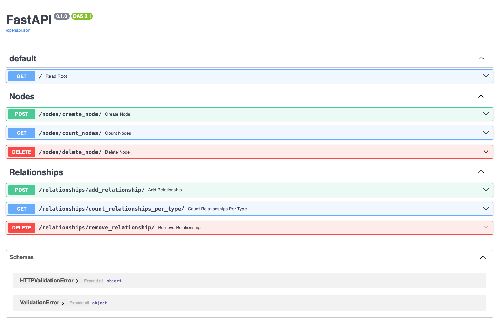

# fastapi-neo4j-api

This project contains a template for setting up a [FastAPI](https://fastapi.tiangolo.com/) application on [Neo4j](https://neo4j.com/docs/). 

## Start the Application
Make sure you have a running Neo4j instance. You can easily deploy a free fully managed instance on [Neo4j Aura](https://neo4j.com/product/auradb). Store the credentials and update the credentials in [credentials.env.template](/credentials.env.template) accordingly. 

To run the FastAPI-application make sure you have installed the required packages: 

```
pip install requirements.txt
```

For starting the application on port 8000 run the following command: 
```
uvicorn app.main:app --reload --port 8000
```

Now you can go to [http://127.0.0.1:8080/docs](http://127.0.0.1:8080/docs) in your web browser to see the following. 

